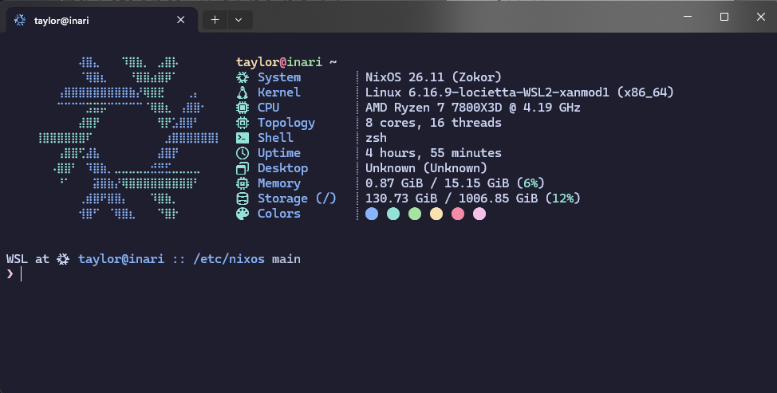
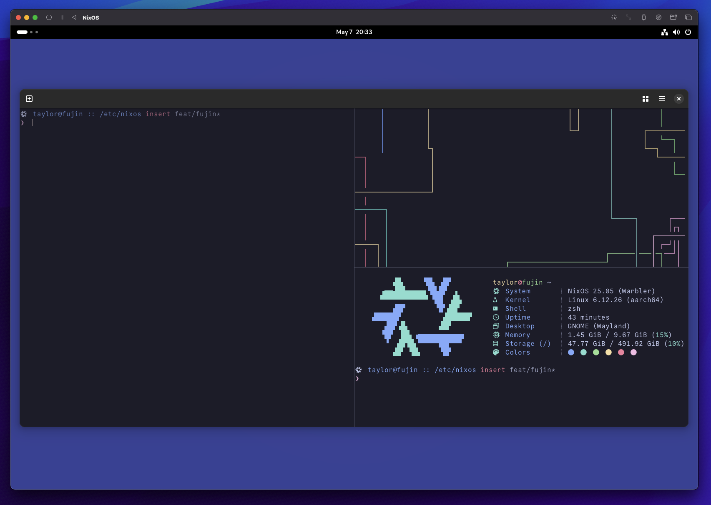
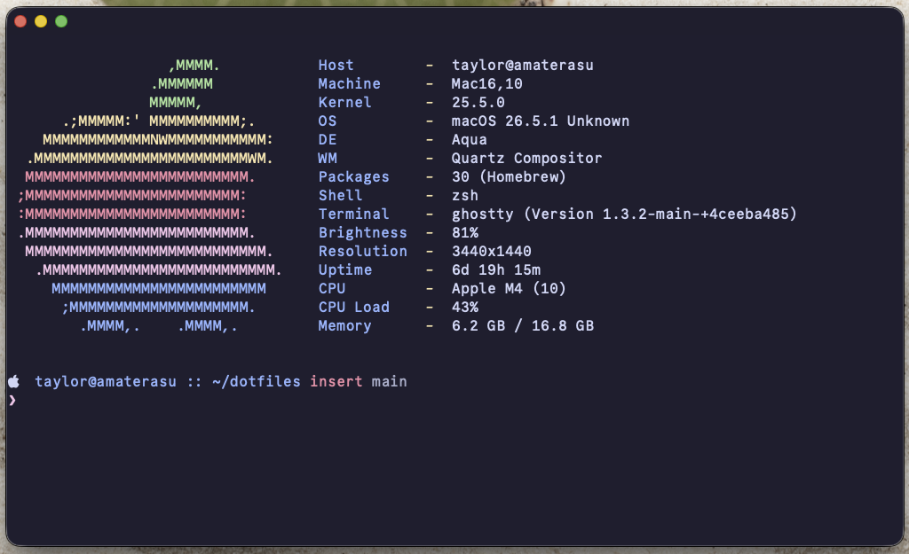

# dotfiles

My cross-platform [Nix](https://nixos.org/) configuration — a single flake that
declaratively manages NixOS, WSL, and macOS (nix-darwin) machines, my dotfiles,
my editor, and my theming.

Each host is named after a Shinto deity.

## Systems

### Inari — WSL

My day-to-day NixOS-on-WSL system (`x86_64-linux`), built on
[NixOS-WSL](https://github.com/nix-community/NixOS-WSL).



### Fujin — NixOS VM

An `aarch64-linux` NixOS virtual machine running the GNOME desktop on Wayland,
themed with [Stylix](https://github.com/nix-community/stylix).



### Amaterasu — macOS

My Apple Silicon Mac (`aarch64-darwin`), managed with
[nix-darwin](https://github.com/LnL7/nix-darwin) and
[nix-homebrew](https://github.com/zhaofengli-wip/nix-homebrew).



## What's inside

- **[hjem](https://github.com/feel-co/hjem)** — manages all user-level config
  files. Used **standalone** (no home-manager) to keep dotfile management fast
  and minimal.
- **[nh](https://github.com/nix-community/nh)** — wraps every NixOS/darwin
  rebuild. All builds and switches go through `nh` rather than the stock
  `nixos-rebuild` / `darwin-rebuild` commands.
- **[nvf](https://github.com/NotAShelf/nvf)** — manages my entire Neovim
  configuration declaratively, shared across every host.
- **[Stylix](https://github.com/nix-community/stylix)** — system-wide theming
  (Catppuccin Mocha by default; Gruvbox available).
- **[llm-agents](https://github.com/numtide/llm-agents.nix)** — Numtide's flake
  packaging LLM coding agents; used here to provide Amp across every host.
- **Shared package set** — one common package list across all hosts plus
  per-host extras, covering shells, dev tooling, cloud CLIs, and more.

> [!NOTE]
> This configuration **does not use
> [home-manager](https://github.com/nix-community/home-manager)** or other
> heavyweight modules. Dotfiles are handled by hjem standalone and the editor by
> nvf, deliberately keeping the module surface small to streamline build and
> switch times.

## Layout

```
.
├── flake.nix          # Entry point; defines all host configurations
├── flake.lock         # Pinned inputs
├── system/            # Per-platform system config (wsl, darwin, aarch64-linux)
│   └── desktop-environment/   # GNOME / KDE Plasma
├── hardware/          # Hardware configuration (aarch64-linux)
├── home/hjem/         # User dotfiles via hjem
├── modules/           # nvf, stylix, nix-darwin, nix-homebrew modules
├── packages/          # Per-platform package sets + fonts
└── images/            # Screenshots used in this README
```

## Usage

Clone the repo and apply the configuration for the relevant host with
[nh](https://github.com/nix-community/nh).

**NixOS / WSL (Inari, Fujin):**

```bash
nh os switch . -H inari   # or -H fujin
```

**macOS (Amaterasu):**

```bash
nh darwin switch . -H amaterasu
```

| Host        | Platform         | Builder     | Config        |
| ----------- | ---------------- | ----------- | ------------- |
| `inari`     | `x86_64-linux`   | NixOS (WSL) | `.#inari`     |
| `fujin`     | `aarch64-linux`  | NixOS       | `.#fujin`     |
| `amaterasu` | `aarch64-darwin` | nix-darwin  | `.#amaterasu` |
